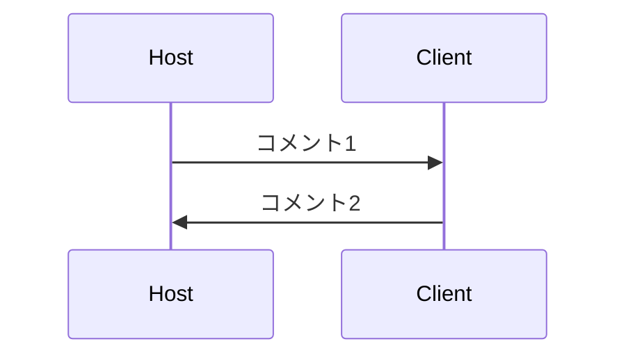

## 研究のロードマップを整理
* 使い方は<a href ="https://note.com/_kikiyo_/n/n67ca638d8c5c?sub_rt=share_pw">ココ</a>を参照

* 今度ココで研究のロードマップを整理しておく。

::: mermaid
graph TD;
    A("`distinguish noise from chaos`")--> chaos;
    A-->C;
    B-->D;
    C-->D;
:::
